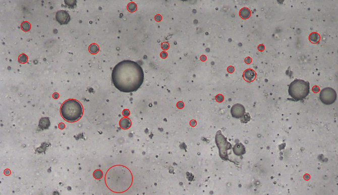

### BLOB特征分析 – simpleblobdetector使用

BLOB是图像中灰度块的一种专业称呼，更加变通一点的可以说它跟我们前面二值图像分析的联通组件类似，通过特征提取中的SimpleBlobDetector可以实现常见的各种灰度BLOB对象组件检测与分离。使用该检测器的时候，可以根据需要输入不同参数，得到的结果跟输入的参数息息相关。常见的BLOB分析支持如下：
-   根据BLOB面积过滤
-   根据灰度/颜色值过滤
-   根据圆度过滤
-   根据长轴与短轴过滤
-   根据凹凸进行过滤

**参数列表:**
```
SimpleBlobDetector::Params::Params()
bool    filterByArea
bool    filterByCircularity
bool    filterByColor
bool    filterByConvexity
bool    filterByInertia
float   maxArea
float   maxCircularity
float   maxConvexity
float   maxInertiaRatio
float   maxThreshold
float   minArea
float   minCircularity
float   minConvexity
float   minDistBetweenBlobs
float   minInertiaRatio
```

代码：
```python
import cv2 as cv
import numpy as np

# load image
frame = cv.imread("zhifang_ball.png")
gray = cv.cvtColor(frame, cv.COLOR_BGR2GRAY)
params = cv.SimpleBlobDetector_Params()

# Change thresholds
params.minThreshold = 0;
params.maxThreshold = 256;

# Filter by Area.
params.filterByArea = True
params.minArea = 100

# Filter by Circularity
params.filterByCircularity = True
params.minCircularity = 0.1

# Filter by Convexity
params.filterByConvexity = True
params.minConvexity = 0.5

# Filter by Inertia
params.filterByInertia = True
params.minInertiaRatio = 0.5

detector = cv.SimpleBlobDetector_create(params)

# Detect blobs.
cv.imshow("input", frame)
keypoints = detector.detect(gray)
result = cv.drawKeypoints(frame, keypoints, None, (0, 0, 255), cv.DRAW_MATCHES_FLAGS_DRAW_RICH_KEYPOINTS)
cv.imshow("result", result)
cv.imwrite("result.png", result)
cv.waitKey(0)
cv.destroyAllWindows()
```


